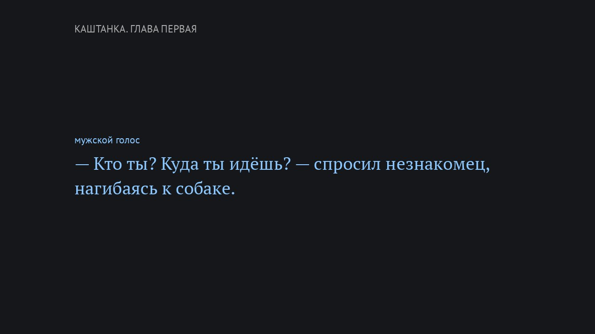

# audiobook-tts

Turn a **Russian EPUB** into an audiobook on your own machine: offline, free, no cloud TTS.

- 🎧 **`.m4b` audiobook** with chapters, cover art and loudness-normalized "studio" sound
- 🎭 **Three voices**: a narrator plus separate male and female voices for dialogue, with the speaker's gender detected from the text
- 📝 **`.srt` subtitles** with the book's original text, timed per sentence
- 🎬 **Optional `.mp4` video** showing the sentence being read, colored by voice



A 6.5-hour book is narrated in about 10 minutes on an Apple M4 Pro. The video takes another 5-10 minutes.

> **Русским читателям.** Скрипт озвучивает русские EPUB локально (Silero TTS + RUAccent) и собирает аудиокнигу `.m4b` с главами, субтитры и видео. Ниже вся инструкция; команды те же. Сообщения и комментарии в коде на русском.

## Contents

- [Requirements](#requirements)
- [Install](#install)
- [Usage](#usage)
- [How it works](#how-it-works)
- [Text normalization](#text-normalization)
- [Dialogue and voices](#dialogue-and-voices)
- [Choices and why](#choices-and-why)
- [Limitations](#limitations)
- [Experimental: F5-TTS](#experimental-f5-tts)
- [Running heavy models safely](#running-heavy-models-safely)
- [Licenses](#licenses)

## Requirements

- Python 3.12 and [uv](https://docs.astral.sh/uv/)
- `ffmpeg` on `PATH` (`brew install ffmpeg` / `apt install ffmpeg`)
- ~2 GB free disk for models and the synthesis cache of one book
- macOS is the tested platform. Linux should work: the video falls back from VideoToolbox to `libx264`, and fonts fall back to DejaVu. If no Cyrillic font is found, set `AUDIOBOOK_TEXT_FONT` and `AUDIOBOOK_LABEL_FONT` to `.ttf`/`.ttc` paths.

The first run downloads the Silero model (~140 MB, via `torch.hub`) and the RUAccent models.

## Install

```bash
git clone https://github.com/ruslanmalogulko/audiobook-tts.git
cd audiobook-tts
uv sync
```

## Usage

**1. List chapters** and decide which service chapters to skip (title page, table of contents, bibliography):

```bash
uv run book2audio.py book.epub --list
```

```
  1. Author Name                                                 430 симв.
  2. Contents                                                   2885 симв.
  3. Предисловие                                                3761 симв.
  ...
Всего: 384,355 символов
```

**2. Make a short sample** to check the voices:

```bash
uv run book2audio.py book.epub --chapters 5 --limit 3000 \
  --speaker eugene --male-voice aidar --female-voice kseniya --name sample
```

**3. Narrate the whole book**, with video:

```bash
uv run book2audio.py book.epub --chapters 3-58,60-63 \
  --speaker eugene --male-voice aidar --female-voice kseniya \
  --name "Book Title" --video
```

Results go to `output/`: `Book Title.m4b`, `Book Title.srt` and, with `--video`, `Book Title.mp4`.

Runs can be resumed. Every synthesized sentence is cached in `output/<book>/cache/`, so a re-run after an interruption or a normalization fix only re-synthesizes what changed.

### Options

| Option | Description |
|---|---|
| `--list` | Print chapters with their size in characters and exit |
| `--chapters 3-58,60` | Chapters to narrate (numbers from `--list`) |
| `--limit N` | Only the first N characters of each chapter (for samples) |
| `--speaker` | Narrator voice: `aidar`, `eugene` (male), `baya`, `kseniya`, `xenia` (female). Default `eugene` |
| `--male-voice`, `--female-voice` | Dialogue voices. Without them the whole book uses the narrator voice |
| `--video` | Also build an `.mp4` with on-screen text |
| `--name` | Output file name (without extension) |
| `--out` | Output directory, default `output/` |
| `--no-accents` | Skip stress marking (faster, less accurate) |
| `--model` | Silero model, default `v5_ru` |
| `--rate 90%` | Speech rate via SSML `<prosody>` (default `100%`) |
| `--comma-pause 250` | Extra pause in ms after commas; 1.5× after `;` `:`, 2× between sentences (default off) |
| `--tts-rate 24000` | Synthesize at 24 kHz instead of 48 kHz, resampled to 48 kHz (default 48000) |
| `--engine f5` | Experimental F5-TTS engine, see below |

## How it works

```
EPUB ─▶ chapters (from the table of contents) ─▶ paragraphs
     ─▶ voice split: narrator / male line / female line
     ─▶ sentences (original text, used for subtitles)
     ─▶ normalization ─▶ stress marks (RUAccent)
     ─▶ Silero TTS, one call per sentence, cached
     ─▶ .m4b (chapters + cover + studio filter) · .srt · .mp4
```

- **Parsing.** `ebooklib` reads the spine in order. Text comes from leaf block elements (`p`, `div`, `li`, `td`, headings…), so books that put text in `<div>` work too. Footnote markers and `<sup>` are dropped. Tiny spine items are merged into the next chapter; chapter titles come from the EPUB table of contents.
- **Timing.** Each sentence is synthesized separately, so its start and end in the final audio are known exactly. Subtitles need no speech recognition or alignment.
- **Audio.** Chapters are concatenated by `ffmpeg` and passed through a fixed filter chain (`STUDIO_FILTER`): high-pass at 70 Hz, a small cut around 280 Hz, a presence boost around 3.2 kHz, a high shelf from 7 kHz, de-essing, gentle compression and loudness normalization to -18 LUFS. Output is AAC 128 kbps mono.
- **Video.** Frames are drawn with Pillow, one per sentence, on a blurred copy of the cover with the cover itself on the left. `ffmpeg` joins them with the audio at 5 fps. Text color depends on the voice: white for the narrator, blue for male lines, pink for female lines.

## Text normalization

Silero reads Cyrillic only and has no text frontend, so the script expands everything else:

| Input | Spoken as |
|---|---|
| `В 1984 г.` | в тысяча девятьсот восемьдесят четвёртом году |
| `летом 1972 года` | летом тысяча девятьсот семьдесят второго года |
| `в XX в.` | в двадцатом веке |
| `3-ю главу`, `на 2-м этаже` | третью главу, на втором этаже |
| `12,5%` | двенадцать целых пять десятых процентов |
| `т.е.`, `и т.д.` | то есть, и так далее |
| `Часть II` | Часть два |
| `HR-BP`, `KPI` | эйч ар-би пи, кей пи ай |
| `Am I a hero?` | эм ай э хиро |

- Numbers are converted with `num2words` (Russian, with case and gender).
- Roman numerals are only converted after words like «Часть», «Глава», or when they are two or more letters. A lone English «I» stays a word.
- Latin script goes through a small English dictionary (`ENGLISH_WORDS`), letter-by-letter spelling for short all-caps abbreviations, and rule-based transliteration for everything else. Add frequent words from your book to the dictionary.
- Stress and «ё» come from [RUAccent](https://github.com/Den4ikAI/ruaccent), which also resolves homographs (за́мок / замо́к).

## Dialogue and voices

A paragraph that starts with a dash is a dialogue line. The author's remark inside it (`— Привет, — сказал Дэн. — Заходи.`) is split off and read by the narrator. A dash counts as a remark boundary only when punctuation precedes it and the remark contains a past-tense verb or gerund. So a dash inside speech (`а вам — как об стену горох`) does not switch voices. Multi-paragraph letters in «quotes» are also read as dialogue.

The speaker's gender is taken from the first source that gives an answer:

1. first person inside the line: «я рада» is female, «я понял» is male;
2. the remark: «ответила Маргарита», via `pymorphy3` (past-tense verb gender or a name);
3. an introducing narration line that ends with a colon: «Маргарита улыбнулась:»;
4. turn-taking in the same dialogue: the nearest known line with the same parity;
5. otherwise, male.

## Choices and why

These were decided by blind listening tests on a real 6.5-hour book:

- **Silero v5 over F5-TTS.** Listeners rated Silero at least as good. In a Whisper check per sentence, F5 had ~5-7% word errors against ~1% for Silero, and it ran 30-60× slower.
- **The `ffmpeg` studio filter over a neural enhancer.** Among four blind variants (raw, studio filter, studio + light room reverb, `resemble-enhance`), the plain studio filter won. It processes a whole book in minutes; the neural enhancer would take ~13 hours.
- **Default voices:** narrator `eugene`, male lines `aidar`, female lines `kseniya`.
- **Default pace, no extra pauses.** Slower rate (90%) and SSML pauses on commas (200-250 ms) lost a blind test to the plain output, so they stay opt-in flags.
- **Studio filter also on headphones.** A softer filter (no high boost, 5-9 kHz cut) and 24 kHz synthesis lost a headphone blind test. The slight metallic tint is Silero's vocoder itself.
- **Pillow frames instead of `ffmpeg` subtitle filters:** Homebrew's `ffmpeg` is built without libass, and drawing frames gives full control over typography.

## Limitations

- **Russian only.** Silero's Ukrainian model `v4_ua` has a single male voice. Ukrainian would also need `ukrainian-word-stress` and Ukrainian normalization rules.
- In a dialogue with three people where a line has no remark, gender guessed from turn-taking can be wrong.
- Numbers after prepositions are not always in the right case («около один миллион»).
- Rare English words are transliterated by rules and may sound off.
- Only 5 Silero voices exist (2 male, 3 female); there is no per-character voice casting.
- `transformers` is pinned below 5: in 5.x RUAccent's stress model fails with a missing `token_type_ids` input.

## Experimental: F5-TTS

A second engine based on the community Russian fine-tune [Misha24-10/F5-TTS_RUSSIAN](https://huggingface.co/Misha24-10/F5-TTS_RUSSIAN) is included. It sounds more expressive but makes more word errors and is much slower (see above).

```bash
uv sync --extra f5
uv run book2audio.py book.epub --engine f5 --f5-checkpoint v2 --f5-steps 32 ...
```

F5 clones a voice from a reference clip. By default the references are generated with Silero. To use a real voice, put a 10-15 second recording and its exact transcript into `output/<book>/refs/<voice>.wav` and `output/<book>/refs/<voice>.txt`. Only clone a voice you have the right to use.

## Running heavy models safely

Some local ML models allocate memory without limit. While testing a neural speech enhancer on MPS with CPU fallback, one run reached 56 GB on a 48 GB Mac and froze the machine. `memguard.py` runs any command and kills it with all its children if it goes over a memory limit or if the system runs low:

```bash
python3 memguard.py --max-gb 12 --min-free-gb 6 -- <command ...>
```

It prints the peak memory when the command ends. Run unfamiliar models on a tiny input first.

## Licenses

The code in this repository is MIT licensed, see [LICENSE](LICENSE).

The models it downloads have their own licenses, and those restrict how the **generated audio** may be used:

| Component | License |
|---|---|
| [Silero models](https://github.com/snakers4/silero-models) | CC BY-NC-SA 4.0, non-commercial |
| [F5-TTS_RUSSIAN](https://huggingface.co/Misha24-10/F5-TTS_RUSSIAN) (optional) | CC BY-NC 4.0, non-commercial |
| [RUAccent](https://github.com/Den4ikAI/ruaccent) | see the project repository |
| [pymorphy3](https://github.com/no-plagiarism/pymorphy3) | MIT |

Use this for personal listening. Respect the copyright of the books you convert: do not distribute audiobooks of books you do not have the rights to.
